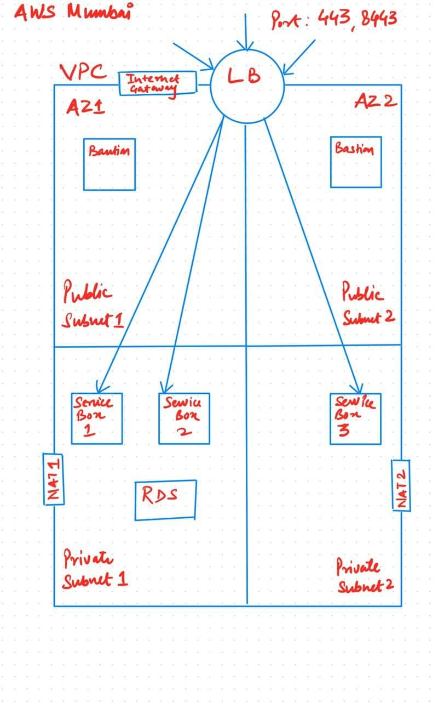

DevOps RoadMap

# Infrastructure

This repository contains the terraform code to generate following architecture.

- Internet Gateway
- NAT.
- Application Loadbalancer.
- Two bastion machines (one per AZ). (Public subnet)
- Three service machines(2+1 AZ). The service box should be in the private subnet.
- Attach 8 GB extra EBS volume to the service box.
- One rds(my-sql/postgres).
- One S3 bucket. Create two users one with read-access and the other with read+write-access to the bucket.

## Directory Structure

├── **backend**                        # It contains ansible playbook which generates s3 bucket and dynamo table for terraform backend. Also generates backend.tf file

├── **modules**                         # terraform modules  for vpc, ec2, rds, s3

├── **environments**                 # Directory to store all the environemtents specific .tfvars files

├── backend.tf                      # terraform backend to store statefile in s3 bucket

├── main.tf                            # call modules

├── variable.tf                       # terraforms variables defined

├── output.tf                         # output required parameters

└── Makefile

# How to run?

### Go to Terraform directory
`$ cd Terraform`

### Install Terraform and Ansible

`$ make prepare`

### Create terraform backend and install terraform modules

`$ make init`

### Terraform plan for given environment

`$ make plan env=dev`

This command will generate the new workspace 'dev' if not created already and run the terraform plan command.

Note: assuming you have file environments/dev.tfvars.

### Terraform apply for given environment

`$ make apply env=dev`

It will generate the aws infrastructure for dev environment.

### Terraform destroy for given environment

`$ make destroy env=dev`

* * *